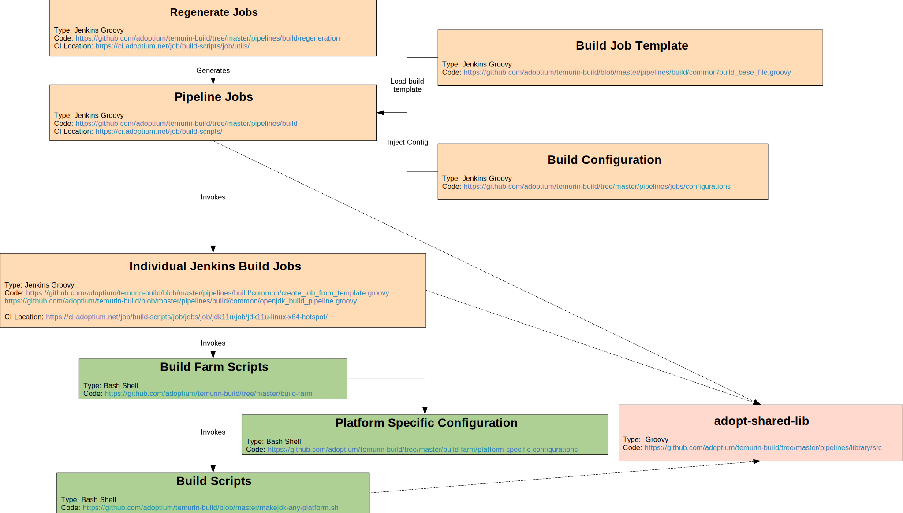

# Architecture

Our build farm has a number of major components:

1. Jenkins Build Pipeline Configuration
1. Adopt build scripts
1. Supporting libraries

## Process

A rough structure of the build is as follows

### Jenkins Job

#### Regenerate Jobs

Jenkins CI jobs are generated by the [regeneration pipelines](https://ci.adoptopenjdk.net/job/build-scripts/job/utils/) in Jenkins. The documentation for this process can be found at [regeneration docs](https://github.com/adoptium/temurin-build/tree/master/pipelines/build/regeneration), however they generate the jobs
at <https://ci.adoptopenjdk.net/job/build-scripts/> which are the builds that coordinate the entire process of nightly
and release builds.

#### Pipeline Jobs

These are the initial scripts that are the top level jobs that are invoked, this in turn invokes the downstream build
jobs for each configuration/platform then coordinates deploying the results to GitHub. The majority of the code that
defines this stage is contained within [build_base_file.groovy](https://github.com/adoptium/temurin-build/blob/master/pipelines/build/common/build_base_file.groovy).

#### Individual Build Jobs

These are invoked by the parent pipeline job and each build creates the archives/installers for a given platform. The majority
of this code is defined in [openjdk_build_pipeline.groovy](https://github.com/adoptium/temurin-build/blob/master/pipelines/build/common/openjdk_build_pipeline.groovy).
