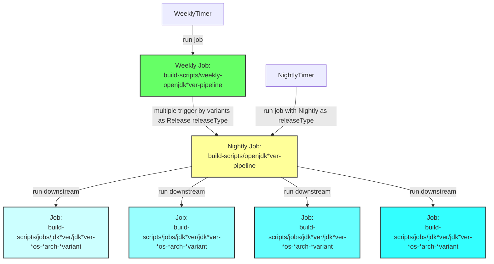
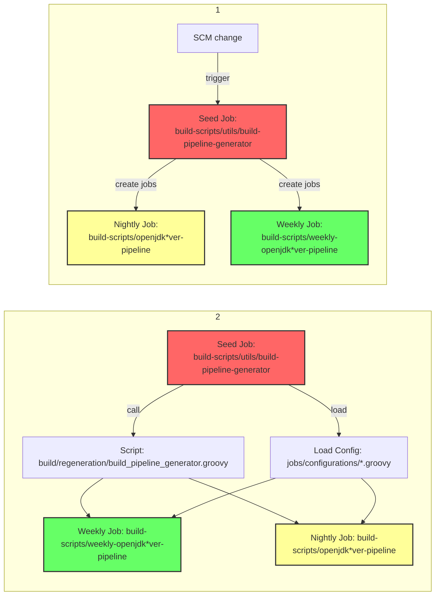
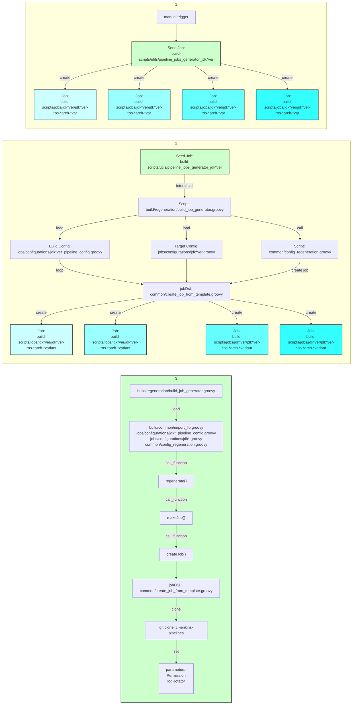
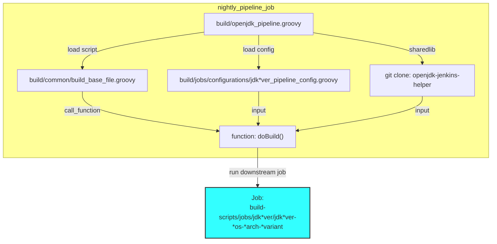
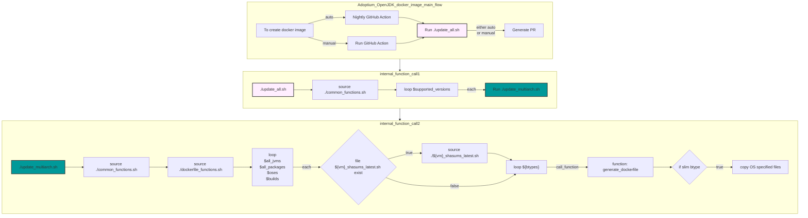
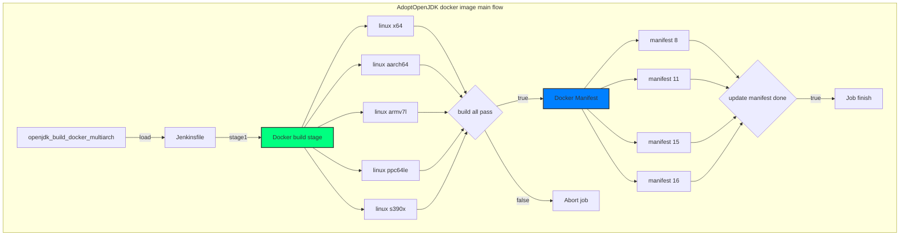
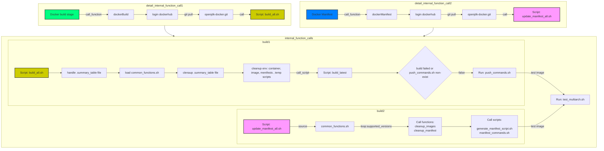

# Diagram

## High level diagram on Jenkins build/test jobs interaction

## High level diagram on Jenkins Job Creation

## Mainflow logic of running Nightly pipeline: build-scripts/openjdk\*ver-pipeline

## Mainflow logic of running build job: build-scripts/jobs/jdk\*ver/jdk\*ver-\*os-\*arch-\*variant

```mermaid

flowchart TD

subgraph job

starter[kick_off_build.groovy] --load--> import[build/common/import_lib.groovy] --load--> Load1["build/common/openjdk_build_pipeline.groovy"] --call_function--> Builder["openjdk_build_pipeline.build()"]
Builder --sharedlib --> Load3[Git repo: openjdk-jenkins-helper]

subgraph internal_build

Load3 --> docker{"DOCKER_IMAGE"}

docker --true: run--> dockerbuild["Jenkins'call: docker.build(build-image)"] --> sign

docker --false:call_function--> CallbuildScript["buildScripts()"] --> sign{enableSigner} --true:call_function--> sign2["sign()"] --> testStage{enableTests}

sign{enableSigner} --"false" --> testStage

testStage --"true:call_function"--> smoketest["runSmokeTests()"] --> parallel{"TEST_LIST.size() > 0"}
testStage --"false"--> shouldInstaller
parallel --"false"--> shouldInstaller

subgraph parallel_tests

parallel --"true: run as stages in pipeline"-->
Stage2["runAQATests() as parallel stages"] --"invoke"-->
smokes[Job: jobs/jdk*ver/jdk*ver-<os>-<arch>-<variant>_SmokeTests]

smokes --run_job--> sanity1[sanity.openjdk]
smokes --run_job--> sanity2[sanity.system]
smokes --run_job--> sanity3[sanity.perf]
smokes --run_job--> sanity4[sanity.functional]
smokes --run_job--> extended1[extended.system]
smokes --run_job--> extended2[extended.functional]
smokes -.->|run weekly extra test job| weekly1[extended.openjdk]
smokes -.->|run weekly extra test job| weekly2[extended.perf]
smokes -.->|run weekly extra test job| weekly3[special.functional]

sanity1 --if:pass--> shouldInstaller
sanity2 --if:pass--> shouldInstaller
sanity3 --if:pass--> shouldInstaller
sanity4 --if:pass--> shouldInstaller
extended1 --if:pass--> shouldInstaller
extended2 --if:pass--> shouldInstaller
weekly1 -->|if:pass| shouldInstaller
weekly2 -->|if:pass| shouldInstaller
weekly3 -->|if:pass| shouldInstaller

end

shouldInstaller{"enableInstallers"} --true:call_function--> bI["buildInstaller()"] --call_function--> sI["signInstaller()"] --> done

shouldInstaller --"false"--> done

end

done["return(..)"]
end

classDef thisjob fill:#33ffff,stroke:#333,stroke-width:2px
classDef inner fill:#ffffff,stroke:#333,stroke-width:2px
classDef external fill:#ffe5cc,stroke:#333,stroke-width:2px
class job thisjob
class parallel_tests inner
class Load1 external

```

## Breakdown logic of build script: build/common/openjdk_build_pipeline.groovy

```mermaid

flowchart TD

subgraph build_scripts

CallbuildScript["function: buildScripts()"] --git_clone--> checkout["git clone: temurin-build"] -->
checkmac{check: Mac && !jdk8u} --true--> flagmac["Call: jmods\nSet flag: --make-exploded-image\n"] --call_script -->
scriptmake["Jenkins sh:script build-farm/make-adopt-build-farm.sh"] --> meta["Call function:\nwriteMetadata()"] --> arch["Jenkins step:\narchiveArtifacts"] --> clean2["Cleanup workspace"]
checkmac --false:call_script--> scriptmake

end

subgraph make-adopt-build-farm

bk1[Script: build-farm/make-adopt-build-farm.sh] --source--> step1[sbin/common/constants.sh] --source -->step[build-farm/set-platform-specific-configurations.sh] --call_script--> step3[makejdk-any-platform.sh]

end

subgraph makejdk-any-platform

bk1.2[Script: makejdk-any-platform.sh] --> source[various shell scripts] --> f1["Call functions:\nconfigure_build\nwriteConfigToFile"] -->
isD{USE_DOCKER} --true:run_function from docker-build.sh--> f3[buildOpenJDKViaDocker] -->dockerarg[set entrypoint to /openjdk/sbin/build.sh] --> cmd["Run: docker build"]
isD --false:run_function from native-build.sh--> f4[buildOpenJDKInNativeEnvironment] --call_script--> sbin["sbin/build.sh"]

end

subgraph build

bk1.3["Script: sbin/build.sh"] --call_function from config_init.sh--> do1.3.1["Call function:\nloadConfigFromFile\nfixJavaHomeUnderDocker\nparseArguments"] -->

is1{"MacOS Logic\nCheck flag: --assemble-exploded-image\n(ASSEMBLE_EXPLODED_IMAGE)"} --true-->
do2.1["Build:\nbuildTemplatedFile\nexecuteTemplatedFile\naddInfoToReleaseFile\naddInfoToJson"] -->
is2{"Check flag: --create-sbom\n(CREATE_SBOM)"} --true--> do3.1["Call functions:\nbuildCyclonedxLib: ant build\ngenerateSBoM"] --post_build-->
post["Call functions:\nremovingUnnecessaryFiles\ncopyFreeFontForMacOS\nsetPlistForMacOS\naddNoticeFile\ncreateOpenJDKTarArchive"] --> finish[Done]
is1 --false--> step1.1.1["pre-build:\nwipeOutOldTargetDir\ncreateTargetDir\nconfigureWorkspace"] -->
BUILD["Build:\ngetOpenJDKUpdateAndBuildVersion\nconfigureCommandParameters\nbuildTemplatedFile\nexecuteTemplatedFile"] --post build--> 
is3{"check flag: --make-exploded-image\n(MAKE_EXPLODED)"} --flase-->
step2.1.1["Call functions:\nprintJavaVersionString\naddInfoToReleaseFile\naddInfoToJson"] --> is2 
is2 --false--> post
is3 --true--> post

end

subgraph writeMetadata

bk2[function: writeMetadata] --> finit{initialWrite} --false--> listArchives[Loop: installer files under target/*]
finit --true:check various files--> check1[target/metadata/*] --load--> check2["file: config/makejdk-any-platform.args"] --> listArchives
listArchives --run--> run[command: shasum on *file] --> write[output: *file.json]

end

build_scripts --> make-adopt-build-farm
build_scripts --> writeMetadata
make-adopt-build-farm --> makejdk-any-platform
makejdk-any-platform --> build

classDef color fill:#ffe5cc,stroke:#333,stroke-width:2px
classDef green fill:#66cc00,stroke:#333,stroke-width:2px
classDef blue fill:#99ccff,stroke:#333,stroke-width:2px
classDef yellow fill:#ffffcc,stroke:#333,stroke-width:2px
classDef red fill:#ff6666,stroke:#333,stroke-width:2px
class bk1,scriptmake,make-adopt-build-farm yellow
class bk1.2,step3,makejdk-any-platform blue
class bk1.3,sbin,build red
class bk2,meta,writeMetadata green
class build_scripts color

```

## High level docker image build flow

### Adoptium OpenJDK docker image(<https://hub.docker.com/_/eclipse-temurin>)

### AdoptOpenJDK docker image(<https://hub.docker.com/u/adoptopenjdk>)

