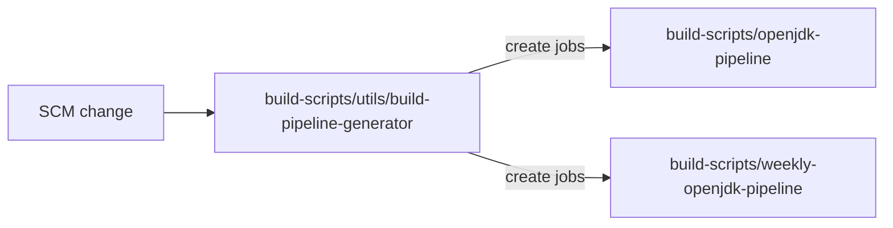
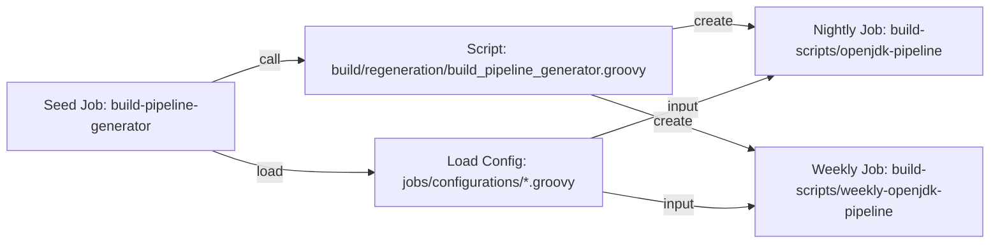
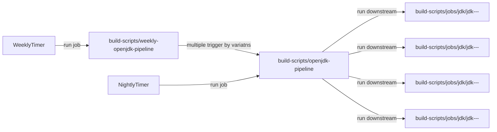
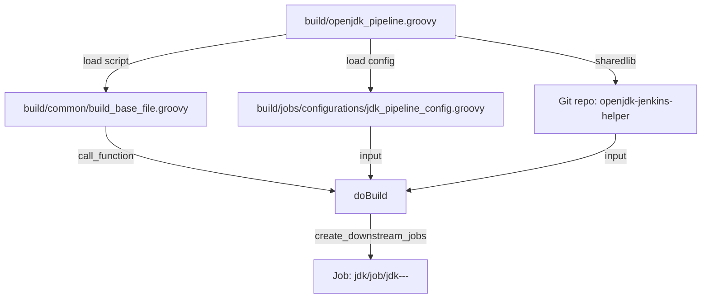
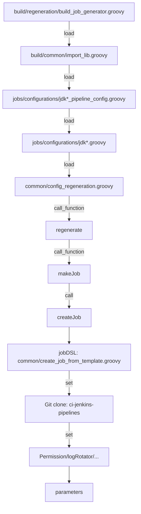

# Diagram

## High level diagram on Jenkins Job Creation





```mermaid
flowchart  LR  
Trigger2[manual trigger] --> Seed2[build-scripts/utils/pipeline_jobs_generator_jdk<ver>]
Seed2 --create--> Downstream1[Job: build-scripts/jobs/jdk<ver>/jdk<ver>-<os>-<arch>-<var>]
Seed2 --create--> Downstream2[Job: build-scripts/jobs/jdk<ver>/jdk<ver>-<os>-<arch>-<var>]
Seed2 --create--> Downstream3[Job: build-scripts/jobs/jdk<ver>/jdk<ver>-<os>-<arch>-<var>]
Seed2 --create--> Downstream4[Job: build-scripts/jobs/jdk<ver>/jdk<ver>-<os>-<arch>-<var>]
 ```

```mermaid
flowchart  LR
Seed2[Seed Job: pipeline_jobs_generator_jdk<ver>] --call-->  
Call2[Script: build/regeneration/build_job_generator.groovy]

Call2 --load--> Load1[Build Config: jobs/configurations/jdk<ver>_pipeline_config.groovy] --loop--> DSL[jobDsl: common/create_job_from_template.groovy]
Call2 --load--> Load2[Target Config: jobs/configurations/jdk<ver>.groovy] --> DSL
Call2 --call--> Load3[Script: common/config_regeneration.groovy] --creatJob--> DSL

DSL --create--> DS1[build-scripts/jobs/jdk<ver>/jdk<version>-<os>-<arch>-<variant>]
DSL --create--> DS2[build-scripts/jobs/jdk<ver>/jdk<version>-<os>-<arch>-<variant>]
DSL --create--> DS3[build-scripts/jobs/jdk<ver>/jdk<version>-<os>-<arch>-<variant>]
DSL --create--> DS4[build-scripts/jobs/jdk<ver>/jdk<version>-<os>-<arch>-<variant>]
```

## High level diagram on Jenkins build/test jobs interaction



## Mainflow logic of creation pipeline: openjdk*ver-pipeline



## Mainflow logic of creation job: "build-scripts/job/utils/job/pipeline_jobs_generator_jdk*ver"



## Mainflow logic of build job: jobs/jdk*ver/jdk*ver-*os-*arch-*variant

```mermaid
flowchart TD
starter[kick_off_build.groovy] --load--> import[build/common/import_lib.groovy] --load--> Load1[build/common/openjdk_build_pipeline.groovy] --call_function--> Builder[build] 
Builder --sharedlib --> 
Load3[Git repo: openjdk-jenkins-helper] --> docker{build in docker}
docker --yes: run--> dockerbuild[docker.build] --> sign
docker --no: call_function--> CallbuildScript[buildScripts] --> sign{enableSigner} --yes:call--> sing[sign] --> testStage{enableTests}
sign{enableSigner} --no:skip --> testStage --yes:call_function--> smoketest[runSmokeTests] --pass:run--> 
smoke[Job: jobs/jdk<ver>/jdk<ver>-<os>-<arch>-<variant>_SmokeTests] --call_function--> Stage2[runAQATests]

Stage2 --run_job--> sanity1[sanity.openjdk]
Stage2 --run_job--> sanity2[sanity.system]
Stage2 --run_job--> sanity3[sanity.perf]
Stage2 --run_job--> sanity4[sanity.functional]
Stage2 --run_job--> extended1[extneded.system]
Stage2 --run_job--> extended2[extneded.functional]

sanity1 --if:pass--> shouldInstaller
sanity2 --if:pass--> shouldInstaller
sanity3 --if:pass--> shouldInstaller
sanity4 --if:pass--> shouldInstaller
extended1 --if:pass--> shouldInstaller
extended2 --if:pass--> shouldInstaller
shouldInstaller --> install{enableInstaller} --yes:call_function--> bI[buildInstaller] --> sI[signInstaller]
 ```

 ```mermaid
flowchart TD 
CallbuildScript[function: buildScripts] --git_clone--> checkout[temurin-build] --call_script -->
script[sh:script build-farm/make-adopt-build-farm.sh] --call_function--> meta[writeMetadata] --call_function -->
arch[archiveArtifacts] --load --> Load2[pipelines/build/common/import_lib.groovy]
```
