# Diagram

## High level diagram on Jenkins Job Creation


```mermaid
flowchart  LR  
Trigger2[manual trigger] --> Seed2[build-scripts/utils/pipeline_jobs_generator_jdk*ver]
Seed2 --create--> Downstream1[Job: build-scripts/jobs/jdk*ver/jdk*ver-*os-*arch-*var]
Seed2 --create--> Downstream2[Job: build-scripts/jobs/jdk*ver/jdk*ver-*os-*arch-*var]
Seed2 --create--> Downstream3[Job: build-scripts/jobs/jdk*ver/jdk*ver-*os-*arch-*var]
Seed2 --create--> Downstream4[Job: build-scripts/jobs/jdk*ver/jdk*ver-*os-*arch-*var]
 ```

```mermaid
flowchart  LR
Seed2[Seed Job: pipeline_jobs_generator_jdk*ver] --call-->
Call2[Script: build/regeneration/build_job_generator.groovy]

Call2 --load--> Load1[Build Config: jobs/configurations/jdk*ver_pipeline_config.groovy] --loop--> DSL[jobDsl: common/create_job_from_template.groovy]
Call2 --load--> Load2[Target Config: jobs/configurations/jdk*ver.groovy] --> DSL
Call2 --call--> Load3[Script: common/config_regeneration.groovy] --creatJob--> DSL

DSL --create--> DS1[build-scripts/jobs/jdk*ver/jdk*ver-*os-*arch-*variant]
DSL --create--> DS2[build-scripts/jobs/jdk*ver/jdk*ver-*os-*arch-*variant]
DSL --create--> DS3[build-scripts/jobs/jdk*ver/jdk*ver-*os-*arch-*variant]
DSL --create--> DS4[build-scripts/jobs/jdk*ver/jdk*ver-*os-*arch-*variant]
```

## High level diagram on Jenkins build/test jobs interaction


## Mainflow logic of creation pipeline: openjdk\*ver-pipeline


## Mainflow logic of creation job: "build-scripts/job/utils/job/pipeline_jobs_generator_jdk*ver"


## Mainflow logic of build job: jobs/jdk\*ver/jdk\*ver-\*os-\*arch-\*variant


## Breakdown logic of build script: openjdk_build_pipeline.groovy

```mermaid

flowchart TD

subgraph build scripts

CallbuildScript[function: buildScripts] --git_clone--> checkout["Repo: temurin-build"] -->
checkmac{check: Mac && !jdk8u} --true--> flagmac["Call:jmods\nSet flag: --make-exploded-image\n"] --call_script -->
scriptmake[sh:script build-farm/make-adopt-build-farm.sh] --> meta["Call function:\nwriteMetadata"] --> arch["Jenkins step:\narchiveArtifacts"] --> clean2["Cleanup workspace"]
checkmac --false:call_script--> scriptmake

end

subgraph make-adopt-build-farm

bk1[Script: build-farm/make-adopt-build-farm.sh] --source--> step1[sbin/common/constants.sh] --source -->step[build-farm/set-platform-specific-configurations.sh] --call_script--> step3[makejdk-any-platform.sh]

end

subgraph makejdk-any-platform

bk1.2[makejdk-any-platform.sh] --> source[various shell scripts] --> f1["Call functions:\nconfigure_build\nwriteConfigToFile"] -->
isD{USE_DOCKER} --true:run_function from docker-build.sh--> f3[buildOpenJDKViaDocker] -->dockerarg[set entrypoint to /openjdk/sbin/build.sh] --> cmd["Run: docker build"]
isD --false:run_function from native-build.sh--> f4[buildOpenJDKInNativeEnvironment] --call_script--> sbin["sbin/build.sh"]

end

subgraph build

bk1.3[sbin/build.sh] --call_function from config_init.sh--> do1.3.1["Call function:\nloadConfigFromFile\nfixJavaHomeUnderDocker\nparseArguments"] -->

is1{"MacOS Logic\nCheck flag: --assemble-exploded-image\n(ASSEMBLE_EXPLODED_IMAGE)"} --true-->
do2.1["Build:\nbuildTemplatedFile\nexecuteTemplatedFile\naddInfoToReleaseFile\naddInfoToJson"] -->
is2{"Check flag: --create-sbom\n(CREATE_SBOM)"} --true--> do3.1["Call functions:\nbuildCyclonedxLib: ant build\ngenerateSBoM"] --post_build-->
post["Call functions:\nremovingUnnecessaryFiles\ncopyFreeFontForMacOS\nsetPlistForMacOS\naddNoticeFile\ncreateOpenJDKTarArchive"] --> finish[Done]
is1 --false--> step1.1.1["pre-build:\nwipeOutOldTargetDir\ncreateTargetDir\nconfigureWorkspace"] -->
BUILD["Build:\ngetOpenJDKUpdateAndBuildVersion\nconfigureCommandParameters\nbuildTemplatedFile\nexecuteTemplatedFile"] --post build--> 
is3{"check flag: --make-exploded-image\n(MAKE_EXPLODED)"} --flase-->
step2.1.1["Call functions:\nprintJavaVersionString\naddInfoToReleaseFile\naddInfoToJson"] --> is2 
is2 --false--> post
is3 --true--> post

end

subgraph writeMetadata

bk2[function: writeMetadata] --> finit{initialWrite} --false--> listArchives[Loop: installer files under target/*]
finit --true:check various files--> check1[target/metadata/*] --load--> check2["file: config/makejdk-any-platform.args"] --> listArchives
listArchives --run--> run[command: shasum on *file] --> write[output: *file.json]

end

classDef green fill:#66cc00,stroke:#333,stroke-width:2px
classDef blue fill:#99ccff,stroke:#333,stroke-width:2px
classDef yellow fill:#ffffcc,stroke:#333,stroke-width:2px
classDef red fill:#ff6666,stroke:#333,stroke-width:2px
class bk1,scriptmake yellow
class bk1.2,step3 blue
class bk1.3,sbin red
class bk2,meta green

```



## High level docker image build

### Adoptium OpenJDK docker image(<https://hub.docker.com/_/eclipse-temurin>)


### AdoptOpenJDK docker image(<https://hub.docker.com/u/adoptopenjdk>)


